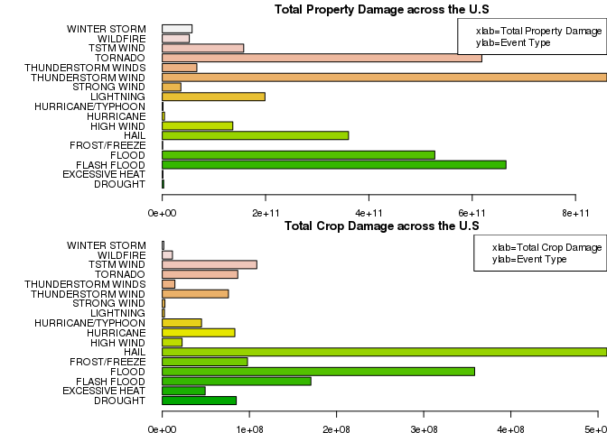

Synopsis
--------

Storms and other severe weather events can cause both public health and
economic problems for communities and municipalities. Many severe events
can result in fatalities, injuries, and property damage, and preventing
such outcomes to the extent possible is a key concern.

This project involves exploring the U.S. National Oceanic and
Atmospheric Administration's (NOAA) storm database. This database tracks
characteristics of major storms and weather events in the United States,
including when and where they occur, as well as estimates of any
fatalities, injuries, and property damage.

In this analysis, we analyse the existing data set to answer two
questions. One of them is regarding the impact of these events on public
health and the other one regarding the economic consequences of these
events.

We subset the existing data set to filter events that have caused
fatalities & injuries (first analysis) and property damage & crop damage
(second analysis) greater than zero. We then calculate the mean for both
the analysis and filter events that have values above the mean so that
we gather higher values. We then plot the analysis using barplots.

In our first analysis, we find that Tornadoes have caused maximum
injuries and fatalities across the United States.

In our second analysis, we find that Flash Floods, Thunderstorm Wind,
Hail and Floods have caused maximum economic damage to the United
States.

Loading data
------------

    storm_data<-read.csv("repdata-data-StormData.csv.bz2")

Data processing
---------------

The values in PROPDMGEXP and CROPDMGEXP are substitued with the right
numeric values from the vector below.

    multiply <- c("?"= "NA" ,"-"= "NA","+"= "NA","0"=0,"1" =10, "2"=100 ,"3"=1000, "4"=10000, "5"=100000, "6"=1000000, "7"=10000000,"8"=100000000, "H"=100, "h"=100, "K"=1000, "M"=1000000, "m"=1000000,"B"=1000000000 )
    storm_data$PROPDMGEXP<-multiply[as.numeric(storm_data$PROPDMGEXP)]
    storm_data$CROPDMGEXP<-multiply[as.numeric(storm_data$CROPDMGEXP)]

    #Multiply values
    storm_data$PROPDMG<-storm_data$PROPDMG * as.numeric(storm_data$PROPDMGEXP)

    ## Warning: NAs introduced by coercion

    storm_data$CROPDMG<-storm_data$CROPDMG * as.numeric(storm_data$CROPDMGEXP)

    ## Warning: NAs introduced by coercion

Analysis
--------

### Which event type has caused harm to population health?

We filter data containing INJURIES and FATALITIES and aggregate by the
sum to calculate total Fatalities and Injuries.

We then filter events whose INJURIES and FATALITIES are greater than the
mean of the same, respectively.

    library(dplyr)

    ## 
    ## Attaching package: 'dplyr'
    ## 
    ## The following objects are masked from 'package:stats':
    ## 
    ##     filter, lag
    ## 
    ## The following objects are masked from 'package:base':
    ## 
    ##     intersect, setdiff, setequal, union

    population_health<-aggregate(cbind(INJURIES,FATALITIES)~EVTYPE,data=storm_data,FUN=sum)

    #Filter rows where injuries and fatalities >0
    population_sub<-filter(population_health,INJURIES>0 | FATALITIES>0)

    #Filter rows whose injuries and fatalities are above the mean to gather max values
    population_sub2<-filter(population_sub,(INJURIES>mean(INJURIES) | FATALITIES>mean(FATALITIES)))

We now look at the cleaned data set depicting only the EVENT TYPE and
the total INJURIES and FATALITIES caused by each event.

    population_sub2

    ##                     EVTYPE INJURIES FATALITIES
    ## 1                AVALANCHE      170        224
    ## 2                 BLIZZARD      805        101
    ## 3          COLD/WIND CHILL       12         95
    ## 4           EXCESSIVE HEAT     6525       1903
    ## 5             EXTREME COLD      231        160
    ## 6  EXTREME COLD/WIND CHILL       24        125
    ## 7             EXTREME HEAT      155         96
    ## 8              FLASH FLOOD     1777        978
    ## 9                    FLOOD     6789        470
    ## 10                     FOG      734         62
    ## 11                    HAIL     1361         15
    ## 12                    HEAT     2100        937
    ## 13               HEAT WAVE      309        172
    ## 14              HEAVY RAIN      251         98
    ## 15              HEAVY SNOW     1021        127
    ## 16               HIGH SURF      152        101
    ## 17               HIGH WIND     1137        248
    ## 18       HURRICANE/TYPHOON     1275         64
    ## 19               ICE STORM     1975         89
    ## 20               LIGHTNING     5230        816
    ## 21             RIP CURRENT      232        368
    ## 22            RIP CURRENTS      297        204
    ## 23             STRONG WIND      280        103
    ## 24       THUNDERSTORM WIND     1488        133
    ## 25      THUNDERSTORM WINDS      908         64
    ## 26                 TORNADO    91346       5633
    ## 27               TSTM WIND     6957        504
    ## 28                WILDFIRE      911         75
    ## 29            WINTER STORM     1321        206

### Which types of events have the greatest economic consequences?

We filter data containing PROPDMG and CROPDMG and aggregate by the sum
to calculate total damages caused to the country.

We then filter events whose PROPDMG and CROPDMG are greater than the
mean of the same, respectively.

    damage_data<-aggregate(cbind(PROPDMG,CROPDMG)~EVTYPE,data=storm_data,FUN=sum)

    #Filter rows where damage>0
    damage_data_sub<-filter(damage_data,PROPDMG>0 | CROPDMG>0)

    #Filter rows whose damage is above the mean to gather max values
    max_damage_data<-filter(damage_data_sub,(PROPDMG>mean(PROPDMG) | CROPDMG>mean(CROPDMG)))

We now look at the cleaned data set depicting only the EVENT TYPE and
the total PROPDMG and CROPDMG caused by each event.

    max_damage_data

    ##                EVTYPE      PROPDMG   CROPDMG
    ## 1             DROUGHT   2821000000  84956000
    ## 2      EXCESSIVE HEAT   1403200000  49240000
    ## 3         FLASH FLOOD 665432480570 170567550
    ## 4               FLOOD 527599061950 358450950
    ## 5        FROST/FREEZE    960000000  97801000
    ## 6                HAIL 360593690180 510306600
    ## 7           HIGH WIND 136592340000  22772200
    ## 8           HURRICANE   4358000570  83300000
    ## 9   HURRICANE/TYPHOON   1535002413  45055015
    ## 10          LIGHTNING 198823980000   2512150
    ## 11        STRONG WIND  36052060000   3048500
    ## 12  THUNDERSTORM WIND 860912440000  75945550
    ## 13 THUNDERSTORM WINDS  66967700000  14514600
    ## 14            TORNADO 618641691060  86632460
    ## 15          TSTM WIND 157655660000 108483950
    ## 16           WILDFIRE  52405470104  11700900
    ## 17       WINTER STORM  57744200000   1784000

Results
-------

We now plot the results of the two questions using barplots.

### Which event type has caused harm to population health?

    #Plot
    par(mar=c(1,15,1,0),cex=0.7)

    barplot(population_sub2$INJURIES,col=terrain.colors(nrow(population_sub2)),names.arg = population_sub2$EVTYPE,horiz = TRUE,las=1,main="Total Injuries across the U.S")
    legend("topright", 
           legend = c("xlab=Total Injuries", "ylab=Event Type"))

    barplot(population_sub2$FATALITIES,col=terrain.colors(nrow(population_sub2)),names.arg = population_sub2$EVTYPE,horiz = TRUE,las=1,main="Total Fatalities across the U.S")
    legend("topright", 
           legend = c("xlab=Total Fatalities", "ylab=Event Type"))

We can see that Tornadoes have caused maximum injuries and fatalities.

### Which types of events have the greatest economic consequences?

    #Plot
    par(mar=c(1.8,13,1.5,0),mfrow=c(2,1),cex=0.7)

    barplot(max_damage_data$PROPDMG,col=terrain.colors(nrow(max_damage_data)),names.arg = max_damage_data$EVTYPE,horiz = TRUE,las=1,main="Total Property Damage across the U.S")
    legend("topright", 
           legend = c("xlab=Total Property Damage", "ylab=Event Type"))

    barplot(max_damage_data$CROPDMG,col=terrain.colors(nrow(max_damage_data)),names.arg = max_damage_data$EVTYPE,horiz = TRUE,las=1,main="Total Crop Damage across the U.S")
    legend("topright", 
           legend = c("xlab=Total Crop Damage", "ylab=Event Type"))

We can see that Flash Floods, Thunderstorm Wind, Hail and Floods have
caused maximum economic damage to the U.S.

Conclusion
----------

We find that Tornadoes have caused maximum injuries and fatalities
across the United States and Flash Floods, Thunderstorm Wind, Hail and
Floods have caused maximum economic damage to the United States.

Thus, resources have to be mobilized efficiently to battle these extreme
weather conditions.
